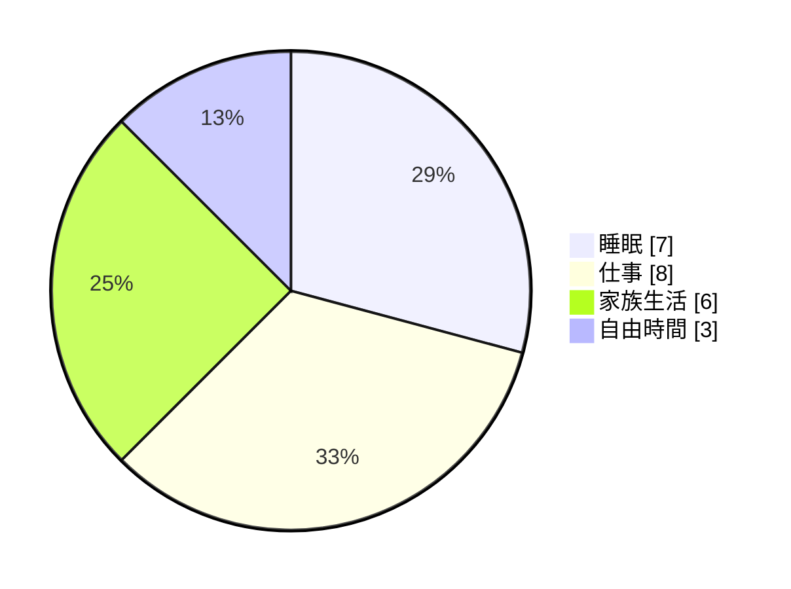

```mermaid
gantt
    title 平日（リモートワーク、残業無し）
    dateFormat HH:mm
    axisFormat %H
    
    section 1日の活動
    
    朝食準備、朝食、洗濯、保育園の送り       :07:00, 2h
    仕事           :09:00, 4h
    昼休憩         :13:00, 1h
    仕事           :14:00, 4h
    夕食準備、夕飯、事後処理       :18:00, 2h
    お風呂、就寝準備       :20:00, 1h
    子どもの寝かしつけとともに就寝  :21:00, 3h
    睡眠           :00:00, 4h
    自由時間      :04:00, 3h

    %% 表示設定
    todayMarker off

    %% 時間軸の調整
    tickInterval 1hour
```

```mermaid
gantt
    title 平日（出勤）
    dateFormat HH:mm
    axisFormat %H
    
    section 1日の活動

    睡眠          :00:00, 4h
    自由時間      :04:00, 2h
    朝食準備、朝食、洗濯、保育園の送り       :06:00, 2h
    通勤           :08:00, 1h
    仕事           :09:00, 4h
    昼休憩         :13:00, 1h
    仕事           :14:00, 4h
    帰宅           :18:00, 1h
    夕飯、事後処理       :19:00, 2h
    お風呂、就寝準備       :21:00, 1h
    子どもの寝かしつけとともに就寝  :22:00, 2h
    

    %% 表示設定
    todayMarker off

    %% 時間軸の調整
    tickInterval 1hour
```

```mermaid
gantt
    title 平日（残業 or オンラインの勉強会 or 飲み会など）
    dateFormat HH:mm
    axisFormat %H
    
    section 1日の活動

    朝食準備、朝食、洗濯、保育園の送り       :07:00, 2h
    仕事           :09:00, 4h
    昼休憩         :13:00, 1h
    仕事           :14:00, 4h
    残業 or 勉強会 or 飲み会       :18:00, 5h
    お風呂、就寝準備  : 23:00, 1h
    睡眠           :00:00, 7h

    %% 表示設定
    todayMarker off

    %% 時間軸の調整
    tickInterval 1hour
```

```mermaid
gantt
    title 休日（お出かけ）
    dateFormat HH:mm
    axisFormat %H
    
    section 1日の活動

    朝食準備、朝食、洗濯       :07:00, 2h
    お出かけ           :09:00, 9h
    夕食準備、夕飯、事後処理       :18:00, 2h
    お風呂、就寝準備       :20:00, 1h
    子どもの寝かしつけとともに就寝  :21:00, 3h
    睡眠           :00:00, 4h
    自由時間      :04:00, 3h

    %% 表示設定
    todayMarker off

    %% 時間軸の調整
    tickInterval 1hour
```

```mermaid
gantt
    title 休日（家でゆっくり）
    dateFormat HH:mm
    axisFormat %H
    
    section 1日の活動

    朝食準備、朝食、洗濯       :07:00, 2h
    子どもと遊ぶ           :09:00, 2h
    自由時間             :11:00, 1h
    お昼                :12:00, 1h
    子どもと遊ぶ           :13:00, 2h
    自由時間             :15:00, 1h
    子どもと遊ぶ           :16:00, 2h
    夕食準備、夕飯、事後処理       :18:00, 2h
    お風呂、就寝準備       :20:00, 1h
    子どもの寝かしつけとともに就寝  :21:00, 3h
    睡眠           :00:00, 4h
    自由時間      :04:00, 3h

    %% 表示設定
    todayMarker off

    %% 時間軸の調整
    tickInterval 1hour
```

# ワークとライフの融合
# ~ 働きパパエンジニアの時間活用術 ~

2025/10/16 presentation for 渋谷でビール片手にLT会！

@kazu_kichi_67

<div class="abs-br m-6 flex gap-2">
  <a href="https://x.com/kazu_kichi_67" target="_blank" alt="X" title="Open in X"
    class="text-xl slidev-icon-btn opacity-50 !border-none !hover:text-white">
    <carbon-logo-x />
  </a>
  <a href="https://github.com/kazu-kichi-67" target="_blank" alt="GitHub" title="Open in GitHub"
    class="text-xl slidev-icon-btn opacity-50 !border-none !hover:text-white">
    <carbon-logo-github />
  </a>
</div>

---
layout: section
---

時間を効率良く使えてますか??

<style>
  p {
    font-size: 32pt;
  }
</style>

---

## 想定リスナー

***

<br>

- 時間はあるけど<span v-mark.red>うまく使えている気がしない</span>方
- <span v-mark.red>子育ても自分の時間も</span>大切にしたいパパママ
- これから<span v-mark.circle.orange>ライフステージ</span>を迎える方

<style>
  ul {
    font-size: 18pt;
  }
</style>

---
src: ./pages/who-am-i.md
hide: false
---

---
layout: section
---

今回お話しするポイントは2つだけ

<style>
  p {
    font-size: 32pt;
  }
</style>

---
layout: section
---

①時間を可視化する

<br>

②時間を効率化する

<style>
  p {
    font-size: 32pt;
  }
</style>

---
layout: section
---

①時間を可視化する

<style>
  p {
    font-size: 32pt;
  }
</style>

---
layout: section
---

可処分時間 = 仕事や家事、育児などの必須タスクを除いた

比較的自由に使える時間

<style>
  p {
    font-size: 24pt;
  }
</style>

---
layout: section
---

1週間の可処分時間は何時間ですか？

<style>
  p {
    font-size: 32pt;
  }
</style>

---

## ワーク

***

<br>



<br>

<div class="grid grid-cols-[30%_40%_30%] gap-4">

<div>
</div>

<div>

</div>

<div>
</div>

</div>

---

## どんどんやっていく

***

<br>



<br>



---

## 休日パターン

***

<br>



<br>



---

## 前提

***

<br>

- 週4出社、週1リモート
- 週2は飲み会や残業がある
- 可処分時間のうち、週4hくらいは純粋な趣味の時間にしたい

<br>

## 可処分時間の合計

***

<br>

```bash
平日：2h x 2日 + 3h = 7h
休日：8h

7h + 8h - 4h = 11h!!
```

参考文献：[タイムマネジメントと再現性を主軸に、持続可能なアウトプット習慣を本気で考えてみた](https://qiita.com/kazu_kichi_67/items/8314c419c6e0cdd07264)

<style>
  ul {
    font-size: 18pt;
  }
  pre.slidev-code {
    background-color: #1f2020;
  }
</style>

---

## 可処分時間のタスク優先度を付けておく

***

<br>

- 通勤時間は、Duolingoや読書をする
- お昼時間にランチセッションに参加する
- 洗濯物を干す時間や、夕飯準備の時間はPodcastを聴く

<br>

<v-click>

→ 可処分時間はアウトプットを優先しよう

</v-click>

<style>
  ul {
    font-size: 18pt;
  }
  p {
    font-size: 32pt;
  }
</style>

---
layout: section
---

ここまでの話、何かに似てません??

<style>
  p {
    font-size: 32pt;
  }
</style>

---

## 私生活にもスクラムは適応出来る

***

<br>

- 会議体をスクラムイベントに<span v-mark.circle.orange>集約</span>することでそれ以外を可処分時間とする
- 可処分時間を把握することで成果物を予測しやすくする
- タイムボックス制を取ることで、<span v-mark.red>作業にフォーカス</span>できる
- スプリントを繰り返すほど<span v-mark.red>精度が上がる</span>

<style>
  ul {
    font-size: 18pt;
  }
</style>

---
layout: section
---

②時間を効率化する

<style>
  p {
    font-size: 32pt;
  }
</style>

---

## 夕飯の献立の認知負荷を下げる

***

<br>

<div class="grid grid-cols-[30%_70%] gap-4">

<div>

</div>

<div>
<br>

- <span v-mark.circle.orange>業務用の冷凍庫</span>を用意
- コストコで肉、魚などのメイン食材をまとめ買い
- 1食分に小分けして冷凍保存
- 味付け用のソースや調味料は潤沢に揃えておく
- 夕飯時はメインを選んで味付けたら完成

</div>
</div>

参考文献：[共働きエンジニア夫婦による夕飯ハック](https://kazu-kichi-67.hatenablog.com/entry/2024/12/13/060902)

<style>
  ul {
    font-size: 18pt;
  }
</style>

---

## 読書 x アウトプット x クラフトビール

***

<br>

<div class="grid grid-cols-[50%_50%] gap-4">

<div class="scale-[0.8] origin-top">
<Tweet id="1967084852471328975" />
</div>

<div class="scale-[0.8] origin-top">
<Tweet id="1967134273770844371" />
</div>

</div>

---

## キャンプ x ワンオペ x LT会

***

参考文献:[キャンプ場で焚き火を囲んでLT会](https://kaitou.connpass.com/event/363314/)

<div class="grid grid-cols-[50%_50%] gap-4">

<div class="scale-[0.7] origin-top">
<Tweet id="1971887242949107856" />
</div>

<div class="scale-[0.7] origin-top">
<Tweet id="1971897203947143213" />
</div>

</div>

---
layout: section
---

①時間を<span v-mark.circle.orange>可視化</span>する

<br>

②時間を<span v-mark.circle.orange>効率化</span>する

<style>
  p {
    font-size: 32pt;
  }
</style>

---
layout: center
class: text-center
hideInToc: true
---

# End

無理せず、楽しく、焦らず行きましょう
